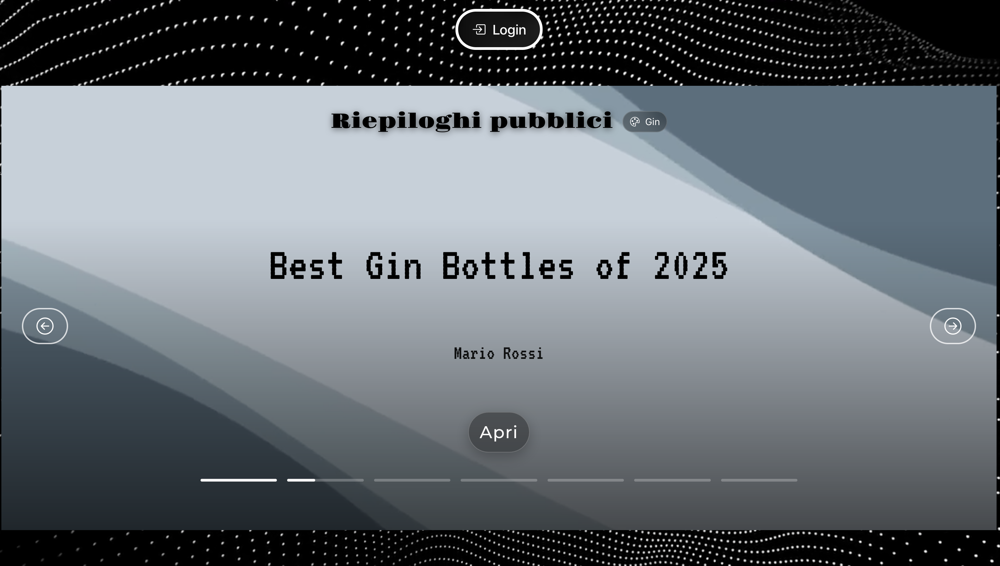
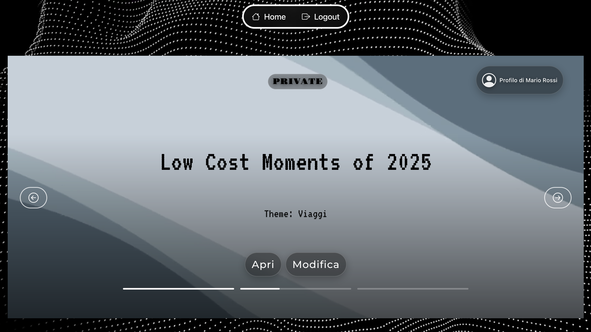
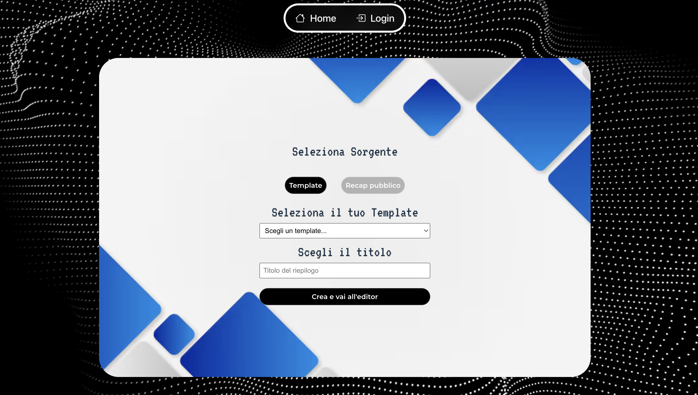
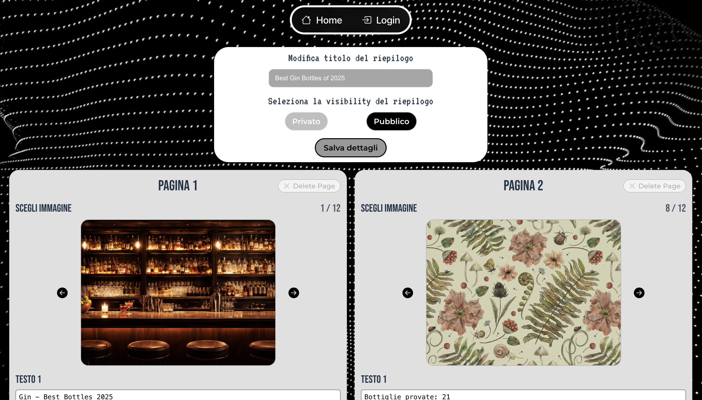

[](https://classroom.github.com/a/VzyEqkSI)
# Exam #4: "Il mio anno in…"
## Student: s352512 RIZZO GABRIELE 

## React Client Application Routes

- Route `/`: 
  - Contenuto: Home page con lista dei riepiloghi pubblici
  - Scopo: Landing page dell’app (accessibile anche senza login). Permette di aprire uno slideshow pubblico e, se autenticato, accedere a creazione e profilo.
- Route `/login`:
  - Contenuto: Form di login (username/email + password)
  - Scopo: Autenticazione utente con session cookie (Passport.js).
- Route `/recaps/:recapId` :
  - Contenuto: Viewer slideshow del riepilogo selezionato
  - Scopo: Mostra le pagine (immagine + testi overlay). Accesso consentito se il riepilogo è pubblico oppure se l’utente autenticato è l’autore.
  - Param: recapId = integer, id del riepilogo.

- Route `/create` :
  - Contenuto: Scelta sorgente creazione (template oppure clone da riepilogo pubblico)
  - Scopo: Permette all’utente autenticato di creare un nuovo riepilogo partendo da:
    - un template (temi presenti: Viaggi o Gin)
    - un riepilogo pubblico esistente (mantenendo tema e tracciando da chi deriva -> autore).
- Route `/editor/:recapId` :
  - Contenuto: Editor del riepilogo (titolo, pagine, testi, visibilità)
  - Scopo: Modifica completa del riepilogo: cambio immagini (solo del tema), testo per slot, aggiunta/rimozione pagine (min 3), scelta visibilità (public/private).
  - Param: recapId = integer, id del riepilogo.
- Route `/profile` :
  - Contenuto: Area personale con riepiloghi dell’utente (inclusi i privati)
  - Scopo: Visualizzazione e accesso ai riepiloghi privati (solo owner).
  
- Route `*` :
  - Contenuto: Not found
  - Scopo: Catch-all per route non definite.

## API Server

- POST `/api/sessions`
  - Parametri / body: username, password
  - Risposta: oggetto utente autenticato (id, username, name)
  - Scopo: autenticazione dell’utente tramite Passport.js e cookie di sessione.
  ```
  {
  "idUser": 1,
  "username": "user1",
  "name": "Mario Rossi"
  }
  ```
- GET `/api/sessions/current`
  - Parametri: nessuno
  - Risposta: oggetto utente autenticato
  - Scopo: verifica della sessione attiva e recupero dell’utente corrente.
  ```
  {
    "idUser": 1,
    "username": "user1",
    "name": "Mario Rossi"
  }
  ```
- DELETE `/api/sessions/current`
  - Parametri: nessuno
  - Risposta: oggetto vuoto
  - Scopo: logout dell’utente e distruzione della sessione.
```
  {
    "idUser": 1,
    "username": "user1",
    "name": "Mario Rossi"
  }
  ```
- GET `/api/recaps/public`
  - Parametri: nessuno
  - Risposta: lista dei riepiloghi pubblici (id, titolo, tema, autore), ed anche da chi deriva un recap se ispirato
  - Scopo: mostrare i riepiloghi pubblici nella home page, accessibili anche senza autenticazione.
  ```
  {
    "id": 1,
    "title": "My year on the road 2025",
    "theme": "Viaggi",
    "author": "Mario Rossi",
    "derivedFromRecapId": null,
    "derivedFromTitle": null,
    "derivedFromAuthor": null
  },
  {
    "id": 3,
    "title": "Best Gin Bottles of 2025",
    "theme": "Gin",
    "author": "Mario Rossi",
    "derivedFromRecapId": null,
    "derivedFromTitle": null,
    "derivedFromAuthor": null
  },
  {
    "id": 4,
    "title": "Travel Work of 2025",
    "theme": "Viaggi",
    "author": "Guido Bianchi",
    "derivedFromRecapId": null,
    "derivedFromTitle": null,
    "derivedFromAuthor": null
  },
  {
    "id": 6,
    "title": "Travel in Europe 2025",
    "theme": "Viaggi",
    "author": "Anna Russi",
    "derivedFromRecapId": null,
    "derivedFromTitle": null,
    "derivedFromAuthor": null
  },
  ```
- GET `/api/recaps/:recapId`
  - Parametri: recapId (integer)
  - Risposta: riepilogo completo in formato slideshow (pagine, immagini, testi)
  - Scopo: visualizzare un riepilogo pubblico o un riepilogo privato dell’utente autenticato.
  ```
  {
  "id": 1,
  "title": "Il mio anno in Viaggio - 2025",
  "visibility": "public",
  "author": "Mario Rossi",
  "themeId": 1,
  "themeName": "Viaggi",
  "derivedFromRecapId": null,
  "derivedFromTitle": null,
  "derivedFromAuthor": null,
  "pages": 
    {
      "id": 1,
      "pageIndex": 0,
      "image": {
        "id": 1,
        "filePath": "/img/viaggi/bg01.jpg",
        "slotsCount": 1,
        "slotsLayoutJson": "[{\"top\":25,\"left\":10,\"width\":80}]"
      },
      "texts": [
        {
          "slotIndex": 0,
          "text": "Il mio anno in Viaggio - 2025"
        }
      ]
    }
  }
  ```
- GET `/api/recaps/:recapId/edit`
  - Parametri: recapId
  - Risposta: fondamentalmente risponde con uno stato, 200, 400 (recap non valido), 401 (utente non loggato), 403 (recap non appartenente all'utente loggato), 404 (recap non trovato), 500 (errore db)
  - Scopo: serve per la pagina di Edit, per definire se l'utente è autenticato e può modificare quel recap
  ```
  {
    "ok": true
  }
  ```
- POST `/api/recaps`
  - Parametri / body: sourceType (template o riepilogo pubblico), sourceId, title
  - Risposta: id del nuovo riepilogo creato
  - Scopo: creare un nuovo riepilogo partendo da un template o da un riepilogo pubblico di un altro utente.
  ```
  {
  "id": 17
  }
  ```
- PUT `/api/recaps/:recapId`
  - Parametri: recapId (integer)
  - Parametri / body: title, visibility
  - Risposta: oggetto vuoto
  - Scopo: aggiornare le informazioni principali del riepilogo (titolo e visibilità).
- PUT `/api/recaps/:recapId/pages`
  - Parametri: recapId (integer)
  - Parametri / body: lista delle pagine con immagini e testi
  - Risposta: oggetto vuoto
  - Scopo: modificare le pagine del riepilogo (immagini di sfondo e testi).

- GET `/api/users/me/recaps`
  - Parametri: nessuno
  - Risposta: lista dei riepiloghi creati dall’utente autenticato
  - Scopo: visualizzare i riepiloghi dell’utente, inclusi quelli privati.
  ```
  {
    "id": 1,
    "title": "Il mio anno in Viaggio - 2025",
    "visibility": "public",
    "author": "Mario Rossi",
    "theme": "Viaggi"
  },
  {
    "id": 2,
    "title": "Viaggi - Low Cost Moments",
    "visibility": "private",
    "author": "Mario Rossi",
    "theme": "Viaggi"
  }
  ```
- GET `/api/themes`
  - Parametri: nessuno
  - Risposta: lista dei temi disponibili (Viaggi, Gin)
  - Scopo: recuperare i temi disponibili per la creazione dei riepiloghi.
  ```
  {
    "id": 1,
    "name": "Viaggi"
  },
  {
    "id": 2,
    "name": "Gin"
  }
  ```
- GET `/api/themes/:themeId/images`
  - Parametri: themeId (integer)
  - Risposta: immagini predefinite associate al tema
  - Scopo: fornire le immagini di sfondo selezionabili per un determinato tema.
  ```
  {
    "id": 1,
    "idTheme": 1,
    "filePath": "/img/viaggi/bg01.jpg",
    "slotsCount": 1,
    "slotsLayoutJson": "[{\"top\":25,\"left\":10,\"width\":80}]"
  },
  {
    "id": 2,
    "idTheme": 1,
    "filePath": "/img/viaggi/bg02.jpg",
    "slotsCount": 1,
    "slotsLayoutJson": "[{\"top\":25,\"left\":10,\"width\":80}]"
  }
  ```
- GET `/api/templates`
  - Parametri: nessuno
  - Risposta: lista dei template disponibili con il relativo tema
  - Scopo: permettere la selezione di un template in fase di creazione del riepilogo.
  ```
  {
    "id": 1,
    "title": "Viaggi - Highlights of the year",
    "themeId": 1,
    "themeName": "Viaggi"
  },
  {
    "id": 2,
    "title": "Viaggi - Low Cost Edition",
    "themeId": 1,
    "themeName": "Viaggi"
  },
  ```

## Database Tables

### User

| Column     | Type    | Constraints                                  |
| ---------- | ------- | -------------------------------------------- |
| idUser     | INTEGER | PRIMARY KEY, AUTOINCREMENT                   |
| username   |   TEXT  | NOT NULL, UNIQUE                             |
| name       |   TEXT  | NOT NULL                                     |
| hash       |   TEXT  | NOT NULL                                     |
| salt       |   TEXT  | NOT NULL                                     |

### Theme

| Column     | Type    | Constraints                                  |
| ---------- | ------- | -------------------------------------------- |
| idTheme    | INTEGER | PRIMARY KEY, AUTOINCREMENT                   |
| name.      |   TEXT  | NOT NULL, UNIQUE                             |

### Image

| Column         | Type    | Constraints                              |
| -------------- | ------- | ---------------------------------------- |
| idImage        | INTEGER | PRIMARY KEY, AUTOINCREMENT               |
| idTheme        | INTEGER | NOT NULL, FOREIGN KEY(Theme.idTheme)     |
| filePath       |   TEXT  | NOT NULL                                 |
| slotsCount     | INTEGER | NOT NULL                                 |
| slotsLayoutJson|   TEXT  | NOT NULL                                 |

### Template

| Column     | Type    | Constraints                                  |
| ---------- | ------- | -------------------------------------------- |
| idTemplate | INTEGER | PRIMARY KEY, AUTOINCREMENT                   |
| idTheme    | INTEGER | NOT NULL, FOREIGN KEY(Theme.idTheme)         |
| title      |   TEXT  | NOT NULL                                     |


### Template_Page

| Column        | Type    | Constraints                               |
| ------------- | ------- | ----------------------------------------- |
| idTemplatePage| INTEGER | PRIMARY KEY, AUTOINCREMENT                |
| idTemplate    | INTEGER | NOT NULL, FOREIGN KEY(Template.idTemplate)|
| pageIndex     | INTEGER | NOT NULL                                  |
| idImage       | INTEGER | NOT NULL, FOREIGN KEY(Image.idImage)      |

### Template_Text

| Column        | Type    | Constraints                                        |
| ------------- | ------- | -------------------------------------------------- |
| idTemplateText| INTEGER | PRIMARY KEY, AUTOINCREMENT                         |
| idTemplatePage| INTEGER | NOT NULL, FOREIGN KEY(Template_Page.idTemplatePage)|
| slotIndex     | INTEGER | NOT NULL                                           |
| text          |   TEXT  |                                                    |

### Recap
| Column        | Type    | Constraints                                        |
| ------------- | ------- | -------------------------------------------------- |
| idRecap       | INTEGER | PRIMARY KEY, AUTOINCREMENT                         |
| title         | TEXT    | NOT NULL                                           |
| visibility    | TEXT    | NOT NULL                                           |
| idTheme       | INTEGER | NOT NULL, FOREING KEY (Theme.idTheme)              |
| idUser        | INTEGER | NOT NULL, FOREING KEY (User.idUser)                |
| authorName    | TEXT    | NOT NULL                                           |
| derFromRecapId| INTEGER | FOREIGN KEY(Recap.idRecap)                         |
| derFromTitle  | TEXT    |                                                    |
| derFromAuthor | TEXT    |                                                    |

### Recap_Page
| Column	      | Type	  | Constraints                                        |
| ------------- | ------- | -------------------------------------------------- |
| idRecapPage	  | INTEGER	| PRIMARY KEY, AUTOINCREMENT                         |
| idRecap	      | INTEGER	| NOT NULL, FOREIGN KEY(Recap.idRecap)               |
| pageIndex	    | INTEGER	| NOT NULL                                           |
| idImage	      | INTEGER	| NOT NULL, FOREIGN KEY(Image.idImage)               |

### Recape_Text
| Column	      | Type	  | Constraints                                        |
| ------------- | ------- | -------------------------------------------------- |
| idRecapText	  | INTEGER |	PRIMARY KEY, AUTOINCREMENT                         |
| idRecapPage	  | INTEGER	| NOT NULL, FOREIGN KEY(Recap_Page.idRecapPage)      |
| slotIndex	    | INTEGER	| NOT NULL                                           |
| text	        | TEXT	  |                                                    |


## Main React Components

- `Login` (in `Login.jsx`):
  - Purpose: Gestisce l’autenticazione dell’utente.
  - Main functionality: Validazione degli input e invio della richiesta di login al server tramite API; aggiorna lo stato di autenticazione dell’applicazione.
- `NavBar` (in `NavBar.jsx`):
  - Purpose: Barra di navigazione principale dell’applicazione.
  - Main functionality: Mostra il nome dell’app, i link principali e, se l’utente è autenticato, il nome dell’utente e il pulsante di logout.
- `ProgressBar` (in `progress.jsx`):
  - Purpose: Barra di avanzamento delle schermate, prev e next
  - Main funcionality: Permette di visualizzare l'avanzamento delle Pages nella route RecapViewer e i vari recap nella home, e permette di cliccare su prev o next per muoversi avanti e indietro tra Pages o Public Recap.
- `StoryGreeting` (in `StoryGreeting`):
  - Purpose: Capire che in un momento x siamo autenticati con un profilo y
  - Main functionality: Fondamentalmente ci mostra solo nome e cognome utente ed è un informazione in più che ci indica che siamo autenticati
- `RecapForm` (in `RecapForm.jsx`)
  - Purpose: Gestire titolo del recap e visibilità sia nella fase di creazione che di modifica di un recap
  - Main functionality: Tramite api aggiornare il db nel momento in cui si effettuano modifiche su titolo e visibilità del riepilogo. Raccogliere la struttura grafica del form.
- `PagesEditor` (in `PagesEditor`)
  - Purpose: Gestire l’editing complessivo delle pagine di un recap.
  - Main functionality: Renderizza l’elenco delle pagine, valida i requisiti minimi e consente il salvataggio delle modifiche tramite API. 
- `PagesCard` (in `PagesCard`)
  - Purpose: Gestire l’editing di una singola pagina del recap.
  - Main functionality: Permette la selezione dell’immagine del tema e la modifica dei testi associati, propagando le modifiche al componente padre.
- `RecapViewer` (in `RecapViewer.jsx`)
  - Purpose: Visualizza un recap in modalità sola lettura.
  - Main functionality: Mostra le pagine del recap con layout grafico e navigazione sequenziale.
- `Profile` (in `Profile.jsx`)
  - Purpose: Mostra i recap appartenenti all’utente autenticato.
  - Main functionality: Permette la visualizzazione e l’accesso alla modifica dei recap personali.
- `Home` (in `Home.jsx`)
  - Purpose: Mostra l’elenco dei recap pubblici disponibili.
  - Main functionality: Visualizza i recap in modalità “story” con navigazione progressiva.
- `Editor` (in `Editor.jsx`)
  - Purpose: Consente la modifica completa di un recap esistente.
  - Main functionality: Gestisce metadati e pagine del recap, coordinando caricamento, validazione e salvataggio tramite API.
- `Create` (in `Create.jsx`)
  - Purpose: Permette la creazione di un nuovo recap partendo da un template o da un recap pubblico.
  - Main functionality: Invia una richiesta di creazione al backend e reindirizza all’editor del recap creato.

## Screenshot
Home

Login

Recap Viewer

Profile Page

Create Recap

Edit Recap

Page not found


## Users Credentials

- user1, password1 (autore di riepiloghi pubblici e privati sui temi Viaggi e Gin)
- user2, password2 (include almeno un riepilogo derivato da un riepilogo pubblico di un altro utente)
- user3, password3 (autore di riepiloghi pubblici visibili nella home page)

## How to run

- Server : 
  - cd server
  - npm install
  - node index.mjs
    - http://localhost:3001

- Client :
  - cd client
  - npm install
  - npm run dev
    - http://localhost:5173
